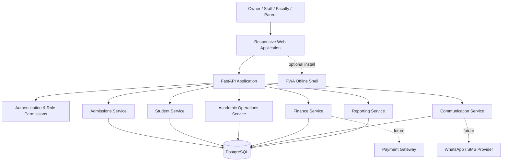
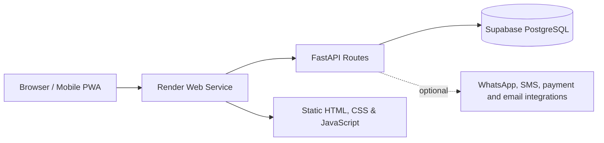
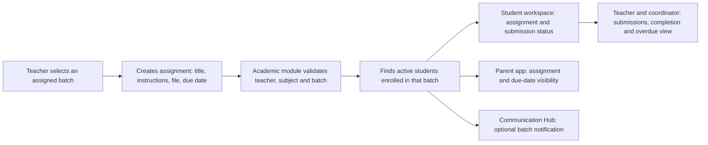
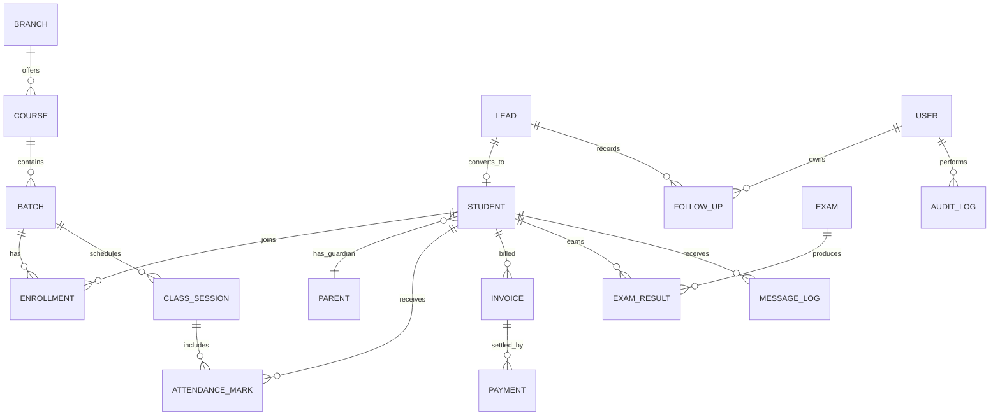
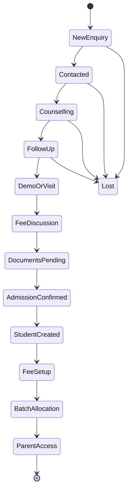

# Lakshya ERP: Software Architecture

## Product principle

Lakshya ERP is a single-centre institute operating system. It is built around one connected student journey rather than separate dashboards: enquiry becomes admission, admission becomes a student record, and that record connects to attendance, fees, academics, communication, and reporting.

Admissions is the first live module. Every later module plugs into the same people, course, batch, and activity data.

## System map



## Deployment architecture

The application is intentionally deployed as **one Render web service**. FastAPI serves both the product UI and the API, while Supabase hosts PostgreSQL. This keeps the first production release simple to deploy and affordable to operate.



## Product modules

| Module | Primary job | Owns | Connects to |
| --- | --- | --- | --- |
| Admissions CRM | Convert enquiries into confirmed admissions | leads, follow-ups, counselling notes, source, conversion | students, fees, communication, reports |
| Student Records | Maintain the single student profile | student, parent, documents, branch, batch, status | attendance, fees, academics, parent app |
| Academics & Batches | Run courses and learning operations | courses, subjects, batches, rooms, timetable, assignments, submissions, faculty mapping | students, attendance, exams, parent app, communication |
| Attendance | Record and act on attendance | sessions, attendance marks, late status, alerts | students, parent app, reports |
| Fees & Finance | Track plans, invoices, receipts and dues | fee plans, invoices, payments, concessions, receipts | admissions, students, communication, reports |
| Inventory | Control institute stock and material movement | stock items, vendors, purchase receipts, issues, adjustments, reorder levels | finance, academics, student allocations, reports |
| Exams & Results | Capture performance and intervention needs | exams, marks, ranks, weak areas, action plans | students, academics, parent app |
| Faculty & Timetable | Plan faculty workload and daily delivery | faculty, availability, room allocation, timetable | academics, attendance, reports |
| Communication Hub | Send trackable messages at the right time | templates, campaigns, message logs, consent | admissions, attendance, fees, parent app |
| Parent App | Give parents controlled visibility | child progress, attendance, fee receipts, notices | students, attendance, fees, exams |
| Reporting & Settings | Give leadership decisions and control | dashboards, exports, users, permissions, audit trail | all modules |

## Assignment delivery workflow

Assignments are published to a batch, never to an uncontrolled institute-wide list. The system resolves the active enrolments for that batch and creates a visible assignment record for each eligible student.



Each assignment stores the teacher, batch, subject, publication time, due date, external file link and per-student status. Assignment files can remain in the institute's Google Drive; the ERP stores the lightweight link and does not need to upload the document to Supabase Storage. A student or parent can only see work for that student’s active batch; teachers can only publish to their assigned batches. Completion, submission and overdue records feed the academic dashboard and the student's learning history.

## Core data model

The following entities are shared across the entire product. No module should create its own duplicate copy of a student, parent, batch, or user.



### Non-negotiable records

- `users` and `roles`: who can see or change each operation.
- `branches`, `courses`, `subjects`, `batches`, and `rooms`: the academic structure.
- `leads`, `follow_ups`, and `lead_activities`: the admissions history.
- `students`, `parents`, `enrollments`, and `documents`: the permanent institute record.
- `invoices`, `payments`, `concessions`, and `receipts`: the financial ledger.
- `inventory_items`, `stock_movements`, `vendors`, and `purchase_receipts`: stock availability, inward entries, issue history, and reorder control.
- `class_sessions`, `attendance_marks`, `exams`, and `exam_results`: academic operations.
- `message_logs` and `audit_logs`: accountability and traceability.

## Admission-to-student workflow



When an admission is confirmed, the system must create the student and enrollment from the existing lead. Data should not be manually re-entered.

## Roles and permissions

| Role | Core permissions |
| --- | --- |
| Owner / Director | all dashboards, approvals, reporting, user control, financial oversight |
| Admissions Manager | team pipeline, lead assignment, conversion review, discount requests |
| Counsellor | assigned leads, notes, follow-ups, new lead entry, conversion handoff |
| Front Desk | walk-ins, basic lead details, document intake, appointment coordination |
| Accounts | fee plans, invoices, receipts, dues, payment confirmation |
| Academic Coordinator | batches, timetable, attendance review, exam operations |
| Faculty | assigned timetable, attendance marking, result entry, student notes |
| Storekeeper / Inventory Clerk | stock inward, issue and return records, stock adjustment requests, and low-stock review |
| Parent / Student | own attendance, fees, results, timetable, notices, requests |

Permissions are enforced by the backend, not only hidden in the interface.

## API boundary

All browser data flows through `/api`. The frontend must never connect directly to the database.

| API area | Examples |
| --- | --- |
| `/api/auth` | sign in, sign out, current user, password reset |
| `/api/admissions` | leads, follow-ups, notes, conversion |
| `/api/students` | profiles, parents, documents, enrollments |
| `/api/academics` | courses, batches, sessions, faculty allocation |
| `/api/attendance` | mark attendance, exceptions, summaries |
| `/api/finance` | fee plans, invoices, payments, receipts, concessions |
| `/api/inventory` | stock items, vendors, purchase receipts, issues, returns, adjustments and reorder alerts |
| `/api/exams` | schedules, marks, analytics, result publishing |
| `/api/communication` | templates, send queue, delivery log |
| `/api/reports` | role-aware summaries and exports |

Each state-changing request records the acting user and timestamp in an audit log.

## Recommended code structure

```text
institution-erp/
  frontend/
    app-shell/
    modules/
      admissions/
      students/
      attendance/
      finance/
      inventory/
      academics/
    shared/
      api/
      components/
      design-tokens/
      state/
  backend/
    app/
      routers/
      services/
      models/
      schemas/
      permissions/
      integrations/
  docs/
```

The current static frontend can remain in the repository root while admissions is stabilised. Before the second module is built, split reusable frontend logic into the `frontend/` structure above so the product does not accumulate duplicate UI code.

## Delivery order

1. **Admissions foundation**: authentication, real leads, follow-ups, counsellor assignment, conversion.
2. **Student and fee handoff**: student profile, documents, batch allocation, fee plan, payment receipt.
3. **Academic operations**: timetable, attendance, faculty workspace, exam and result capture.
4. **Inventory and reporting**: stock control, purchasing, material issue, reorder alerts and reporting.
5. **Parent experience**: notices, attendance, fees, results, support requests.
6. **Leadership and automation**: reports, approvals, WhatsApp/SMS rules, audit logs, exports.

## Production rules

- Never expose database credentials in frontend code or Git.
- Use migrations for every database change once the schema moves beyond the first admissions table.
- Store passwords only as strong hashes; add secure session or token authentication before staff use the system.
- Validate permissions and input on every API endpoint.
- Keep external services optional behind integration adapters so a WhatsApp or payment provider can change without rewriting core modules.
- Back up the database and keep audit logs for financial and admission actions.
